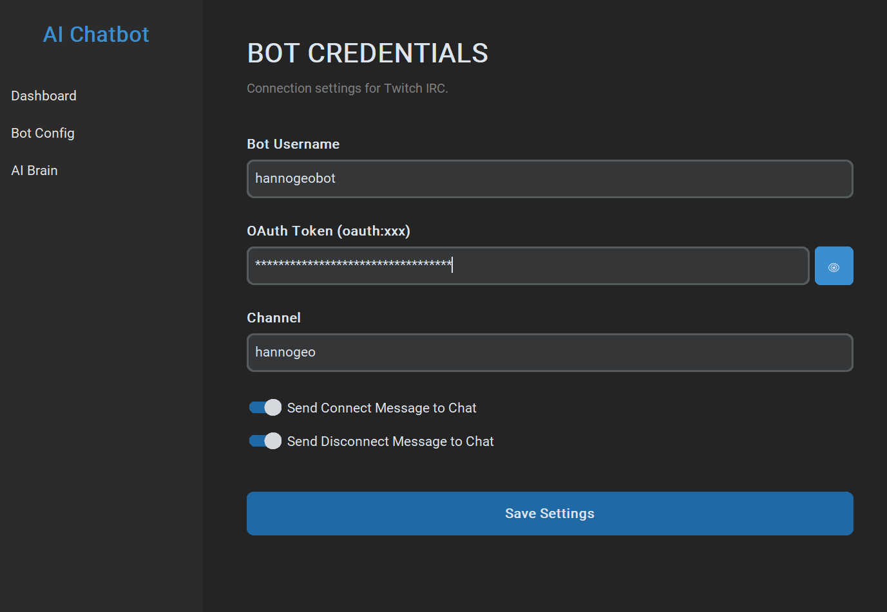
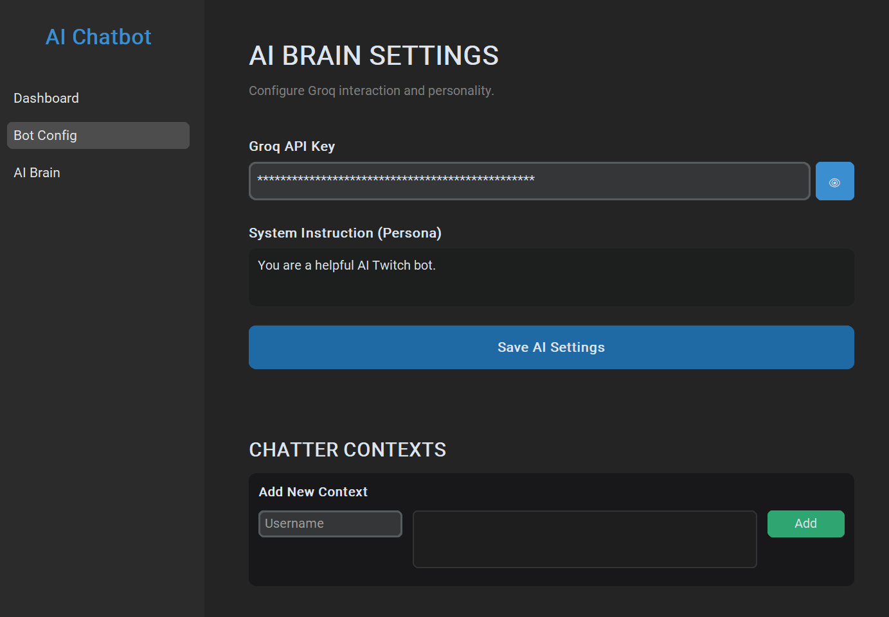

# AI Chatbot

This is a Twitch bot that you can use to add AI chatbot functionality to your stream's chat!

## Setup

Just download the ZIP, extract the files to a folder, and run the app. It will later create some other necessary files inside that folder, make sure you do not delete any of those.

You can then set it up by going to the Bot Config settings, entering the username of the channel you're streaming on and the username of the bot channel (the channel that will be used for sending bot messages). You will also need to enter an OAuth token, which you can create on https://twitchtokengenerator.com (this is so that the bot can send messages from the selected account)

To save changes, click on the "Save Settings" button.

Now navigate to the AI Brain settings on the sidebar. There you can enter a Groq API key (you can create one for free on https://console.groq.com/keys). You can also give the AI some instructions on how it should answer the questions (for example what its attitude should be like, or add info about your channel). In Chatter Contexts, you can add context for the AI about specific users that might often appear in your chat.

That's it! You can now go back to the Dashboard and start using the bot.

## Updates

If a new version becomes available, it will show up in the app and you can easily update it right there.

*
I will be constantly updating the app with bug fixes and new features. If you have any suggestions or bugs that you would like to report, feel free to let me know (preferably on Discord DMs: @hannogeo)
*
